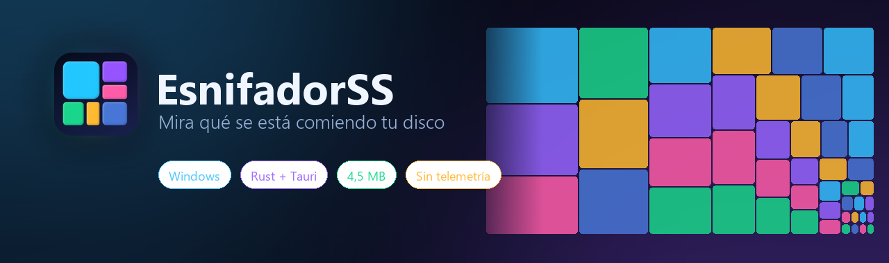

<div align="center">



<br />


**Visualizador de espacio en disco para Windows.**
Cada rectángulo ocupa lo que ocupa en el disco, así que lo que sobra se ve de un vistazo.

</div>

---

## 🎯 Qué es

Analiza una unidad o carpeta y la dibuja como un mapa de árbol. Un archivo de 8 GB
es una caja grande. Una carpeta con mil archivos de 2 KB es una mancha diminuta.
No hay que leer ninguna tabla: **el tamaño se ve**.

El escaneo va en Rust, en paralelo; la interfaz es HTML sobre lienzo dentro de
Tauri 2. El ejecutable ronda los **4,5 MB** y no empaqueta ningún runtime: usa el
WebView2 que Windows 10 y 11 ya traen puesto.

> 🔒 No se conecta a internet. No manda nada a ninguna parte. No hay cuentas,
> ni anuncios, ni «versión pro».

## 📥 Descarga

Busca la última versión en **[Releases](../../releases)**:

| Archivo | Para qué |
|---|---|
| `EsnifadorSS.exe` | **Portable.** Se ejecuta tal cual, no instala nada |
| `EsnifadorSS_x64-setup.exe` | **Instalador**, con accesos directos y desinstalador |

## ✨ Qué trae

| | |
|---|---|
| 🗺️ **Mapa de árbol** | Teselado *squarified*: los bloques tienden al cuadrado, que es lo que los hace comparables de un vistazo |
| 🔍 **Zoom infinito** | Doble clic para entrar, clic derecho para salir, rueda para más o menos detalle |
| 🎨 **8 temas** | Deep Space, Midnight Glass, Nordic Light, Solar Flare, Emerald, Neon Terminal, Candy Pop y Slate Pro |
| 🏷️ **Filtros con sintaxis** | `*.mp4|>500mb`, fechas, atributos, exclusiones. Lo que coincide se resalta y el resto se atenúa |
| 🧹 **Detector de carpetas prescindibles** | `node_modules`, cachés de pip/npm, temporales… separando lo que se regenera solo de lo que hay que revisar |
| 📊 **Panel de estadísticas** | Los 20 archivos y carpetas más grandes, y el reparto por extensión |
| 🗑️ **Papelera** | Borrado con confirmación, y el mapa se recalcula sin volver a escanear |
| 🗂️ **Pestañas** | Varios discos abiertos a la vez, cada uno con su análisis |
| ⚡ **Rápido** | ~700.000 archivos en 6 s en NVMe. Ajusta los hilos según el disco sea SSD o mecánico |

## ⌨️ Uso

| Acción | Cómo |
|---|---|
| Entrar en una carpeta | Doble clic |
| Subir un nivel | Clic derecho en el fondo, o `Retroceso` |
| Más / menos detalle | Rueda del ratón, o `+` / `−` |
| Atrás / adelante | `Alt` + `←` / `→` |
| Volver a analizar | `F5` o `Ctrl` + `R` |
| Ir al filtro | `Ctrl` + `F` |
| Nueva pestaña / cerrar | `Ctrl` + `T` / `Ctrl` + `W` |
| Papelera / borrado definitivo | `Supr` / `May` + `Supr` |
| Ayuda de filtros | `F1` |

### 🏷️ Sintaxis del filtro

```text
*.mp4|*.mkv      alternativas separadas por |
>500mb           más grande que (b, kb, mb, gb, tb)
<1gb             más pequeño que
>2024/01/31      modificado después de esa fecha
<2023-12-01      modificado antes de esa fecha
:oculto          atributo: oculto, sistema, sololectura, comprimido, cifrado, temporal
:carpeta         solo carpetas   ·   :fichero solo archivos
informe          texto suelto: el nombre lo contiene
*.log >1mb       varias condiciones se cumplen a la vez
*.*;*.tmp        lo que va tras el ; se excluye
```

## 🔧 Compilar

Requiere [Node.js](https://nodejs.org) y [Rust](https://rustup.rs).

```bat
start.bat     :: modo desarrollo, con recarga en caliente
deploy.bat    :: compila y deja portable + instalador en deploy-hosting\
```

Pruebas del backend: `cd src-tauri && cargo test`

### 🗃️ Estructura

```
src/                  interfaz — sin bundler, módulos ES nativos
  js/themes.js        paleta única: variables CSS y colores del mapa
  js/treemap.js       teselado, pintado y animación de zoom
  js/main.js          pestañas, navegación, filtro, panel lateral
src-tauri/src/
  scan.rs             recorrido paralelo del disco
  tree.rs             árbol en arena plana y consultas
  filter.rs           analizador de la sintaxis de filtros
  suspects.rs         detector de carpetas prescindibles
  fsops.rs            abrir, explorador, propiedades, papelera
```

## 🧠 Detalles que conviene saber

- **El árbol vive en un arena plano en orden BFS.** El índice de un padre siempre
  es menor que el de sus hijos, y eso permite propagar las coincidencias del
  filtro hacia arriba en un único bucle, sin recursión.
- **El frontend nunca recibe el árbol entero.** Pide solo la porción que cabe en
  pantalla; lo que no llegaría ni a un píxel se agrupa en un bloque «resto».
- **No se dibuja el espacio libre**, solo lo que ocupa el disco. Sí aparece el
  espacio *no identificado*: el hueco entre lo que Windows dice que está usado y
  lo que se ha podido medir.
- **Los enlaces simbólicos y las uniones se cuentan pero no se siguen**, para no
  entrar en bucles ni sumar los mismos bytes dos veces.
- **Hay carpetas que ni un administrador puede leer.** `System Volume Information`
  o el índice de búsqueda están reservadas a SYSTEM. La app lista cuáles son.
- **Un archivo abierto para escritura puede aparecer con tamaño cero:** NTFS no
  refresca la entrada de directorio hasta que se cierra el descriptor. El
  Explorador de Windows se comporta igual.

<div align="center">

---

hecho con 💙 por [poxi](https://github.com/PoxiiTV)

</div>

---

<div align="center">

# 🇬🇧 English

</div>

## 🎯 What it is

**Disk space visualizer for Windows.** It scans a drive or folder and draws it as
a treemap. An 8 GB file is a big box; a folder with a thousand 2 KB files is a
speck. No table to read — **you just see the size**.

Scanning runs in parallel in Rust; the UI is HTML on canvas inside Tauri 2. The
executable is around **4.5 MB** and bundles no runtime — it uses the WebView2 that
already ships with Windows 10 and 11.

> 🔒 It never connects to the internet. No accounts, no ads, no "pro version".

## 📥 Download

Grab the latest build from **[Releases](../../releases)**:

| File | What it is |
|---|---|
| `EsnifadorSS.exe` | **Portable.** Just run it, installs nothing |
| `EsnifadorSS_x64-setup.exe` | **Installer**, with shortcuts and an uninstaller |

## ✨ Features

Squarified treemap · infinite zoom · 8 themes · filter syntax · disposable-folder
detector (`node_modules`, package caches, temp files) · top-20 panels · recycle
bin with confirmation · tabs · ~700,000 files in 6 s on NVMe.

## ⌨️ Shortcuts

| Action | How |
|---|---|
| Enter a folder | Double click |
| Go up one level | Right click on the background, or `Backspace` |
| More / less detail | Mouse wheel, or `+` / `−` |
| Back / forward | `Alt` + `←` / `→` |
| Rescan | `F5` or `Ctrl` + `R` |
| Focus the filter | `Ctrl` + `F` |
| New tab / close | `Ctrl` + `T` / `Ctrl` + `W` |
| Recycle bin / permanent delete | `Del` / `Shift` + `Del` |
| Filter help | `F1` |

Filter syntax matches the Spanish section above; attribute keywords also accept
English names (`:hidden`, `:system`, `:readonly`, `:encrypted`, `:temporary`,
`:dir`, `:file`).

## 🔧 Building

Requires [Node.js](https://nodejs.org) and [Rust](https://rustup.rs).

```bat
start.bat     :: dev mode with hot reload
deploy.bat    :: builds portable + installer into deploy-hosting\
```

Backend tests: `cd src-tauri && cargo test`

## 🧠 Things worth knowing

- **The tree lives in a flat arena in BFS order.** A parent's index is always
  lower than its children's, which lets filter matches propagate upward in a
  single loop, no recursion needed.
- **The frontend never receives the whole tree.** It only asks for the slice that
  fits on screen; anything that wouldn't reach a single pixel is folded into a
  "remainder" block.
- **Free space is not drawn**, only what actually occupies the disk. *Unidentified*
  space is shown: the gap between what Windows reports as used and what could be
  measured.
- **Symlinks and junctions are counted but not followed**, to avoid loops and
  double-counting the same bytes.
- **Some folders are unreadable even for an administrator.** `System Volume
  Information` and the search index are reserved for SYSTEM. The app lists which
  ones were skipped.
- **A file held open for writing may report zero bytes:** NTFS does not refresh
  the directory entry until the handle closes. Windows Explorer behaves the same.

<div align="center">

---

made with 💙 by [poxi](https://github.com/PoxiiTV)

</div>
